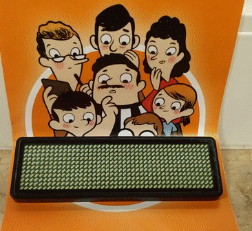

# Nametag Reverse Engineering

Reverse-engineering a LED nametag display to be programmed using a Linux system.

Made during the [MLH Local Hack Day 2018, Kiel](https://localhackday.mlh.io/lhd-2018/events/1299).

The application to program the display in the nametag was available for Windows systems only, so we reverse engineered the USB connection protocol and implemented it in a simpler way for use across different OSes(Linux, Windows and potentially MacOS).

## Contributors

 - Lars Thestorf
 - Subodh Dahal

